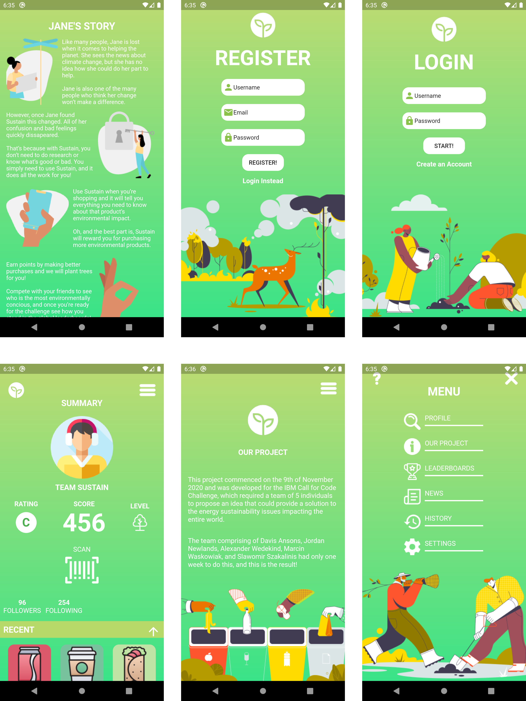
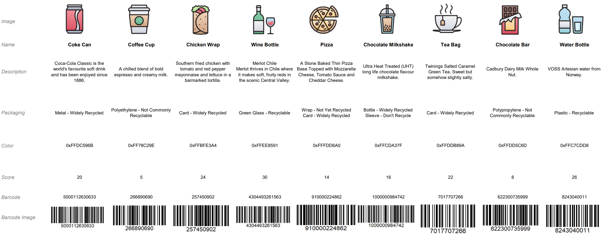

# Sustain

[](https://www.apache.org/licenses/LICENSE-2.0) 

Sustain enables you to reduce your environmental impact by simply scanning the products you buy.

## Contents
  - [Description](#description)
  - [Screenshots](#app-screenshots)
  - [The architecture](#the-architecture)
  - [Project roadmap](#project-roadmap)
  - [Getting started](#getting-started)
    - [Prerequisites](#prerequisites)
    - [Installing](#installing)
  - [Running the tests](#running-the-tests)
  - [Live demo](#live-demo)
  - [Built with](#built-with)
  - [Authors](#authors)
  - [License](#license)
  - [Acknowledgments](#acknowledgments)

## Description

-  Sustain is an energy sustainability solution developed by a team of students based in Scotland. Sustain was designed and developed with the realisation that the majority of individuals around the globe did not have the environmental education required to make purchases that had less impact on the earth. For many it is also daunting to make the change due to the complexities around product packaging, and many also feel that their individual shift to a greener lifestyle would not make a significant difference in their community, or globally. 

- The application which can be downloaded on mobile devices, allows users to scan the products they purchase. Once scanned the application interacts with an IBM Cloudant database via a flask app on Cloud Foundry to retrieve information about the product, such as its energy score, which derives from its certified energy rating. Our goal was to make users visit this app every day, we didn’t want the novelty to wear off after a short period of time, instead we needed a long term solution that would build good habits and educate individuals without requiring the user to perform extensive research. 

- To achieve this we decided to use gamification, which uses aspects of game design to increase user engagement and motivation. The score of each product is added to the users profile, and once they reach a certain milestone, we plant a tree for the user. To encourage the purchase of products with higher energy ratings we also give the user an overall energy rating, which is determined by the average rating of the products they purchase. The app also introduces a competitive aspect by allowing you to follow your friends and family to see their rating, and compete in the local and global leaderboards to see how they hold up against the entire globe. 
 
- Early on we decided to network with charities who could collaborate with us to allow user rewards such as planting trees. The application has already received positive attention from local and national charities who believe this is an interesting solution, and have expressed an interest in future collaboration. We believe the application offers extensive possibilities in scalability, which would allow us to work with a plethora of charities around the globe and provide rewards for users in a greater variety of ways. 

The application also presents endless scalability opportunities such as adding additional products outside of the food category, and using location services to promote more active commuting to reduce the number of cars on the road. Furthermore, features such as the leaderboards could be used to organise city wide events, in which different parts of the world can compete to reduce their impact.

## App Screenshots


## The architecture

1. The user opens the app and scans a barcode
2. Our flask app in Cloud Foundry queries our Cloudant database for product data
3. Object Storage returns the associated product image
4. The app presents the information to the user

## Project roadmap


## Getting started

These instructions will get you a copy of the project up and running on your local machine for development and testing purposes.

### Prerequisites

The flutter framework is required to run this app, the instructions for installing can be found [here](https://flutter.dev/docs/get-started/install)

### Installing

To run the app in debug mode for testing

```bash
flutter run

> Launching lib\main.dart on [Device] in debug mode...
```

## Running the tests

The app can be tested but time constraints meant tests were not written.

```bash
flutter test

> +1: All tests passed!
```

The barcode scanning feature can be tested against our sample product sheet.



## Live demo
An early access release of our app is now live on the playstore, check it out [here](https://play.google.com/store/apps/details?id=com.newlandsjordan.sustain)!

Please note that due to the nature of the release there may be small bugs still lurking.

## Built with

* [IBM Cloudant](https://cloud.ibm.com/catalog?search=cloudant#search_results) - The NoSQL database used
* [IBM Cloud Foundry](https://cloud.ibm.com/catalog?search=cloud%20foundry#search_results) - The cloud compute used
* [IBM Object Storage](https://cloud.ibm.com/catalog?search=object%20storage#search_results) - The image storage solution used
* [Flutter](https://flutter.dev/) - App framework used

## Authors

Team Sustain

* **Alexander Wedekind** 
* **Davis Ansons**
* **Jordan Newlands**
* **Marcin Waskowiak**
* **Slawomir Szakalinis** 

## License

This project is licensed under the Apache 2 License - see the [LICENSE](LICENSE) file for details

## Acknowledgments

* Based on [Billie Thompson's README template](https://gist.github.com/PurpleBooth/109311bb0361f32d87a2).
